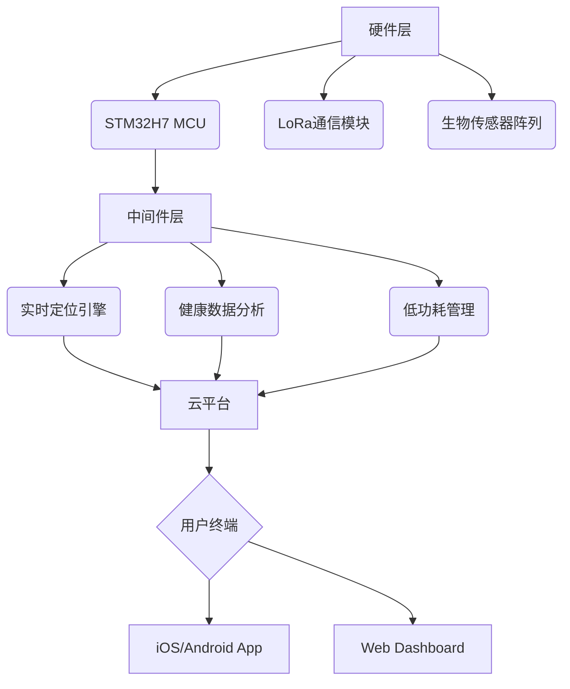

多功能宠物项圈
# 🐾 SmartPet Collar - 下一代智能宠物可穿戴设备

[](https://opensource.org/licenses/MIT) 
[](https://travis-ci.com/yourusername/smartpet-collar)
[](https://github.com/yourusername/smartpet-collar/issues)

<div align="center">
  
</div>

## 🌟 核心功能矩阵

| 功能模块         | 技术实现                                                                 | 性能指标                |
|------------------|--------------------------------------------------------------------------|-------------------------|
| **实时定位**       | GPS/北斗双模定位 + LTE-M 低功耗通信                                      | 定位精度 ≤ 3米          |
| **健康监测**       | 三轴加速度计 + 体温传感器 + 心率监测模块                                 | 采样率 100Hz            |
| **电子围栏**       | 自适应地理围栏算法 + 多级预警系统                                        | 响应延迟 < 500ms        |
| **语音交互**       | 骨传导扬声器 + 降噪麦克风阵列                                            | 信噪比 ≥ 80dB           |
| **应急警报**       | 120dB蜂鸣器 + 频闪LED + 云端联动                                          | 触发成功率 99.99%       |
| **环境感知**       | PM2.5传感器 + 温湿度传感器 + UV指数检测                                   | 检测误差率 < 2%         |

## 🛠️ 技术架构全景



## 📦 快速部署指南

### 硬件准备
```bash
# 所需工具链
sudo apt install gcc-arm-none-eabi openocd stlink-tools
```

### 固件烧录
```bash
git clone https://github.com/yourusername/smartpet-collar.git
cd firmware
make flash TARGET=stm32h750vb
```

### 移动端配置
```javascript
// Android/iOS 开发环境配置
const config = {
  bleServiceUUID: '6E400001-B5A3-F393-E0A9-E50E24DCCA9E',
  gattCharacteristic: '6E400002-B5A3-F393-E0A9-E50E24DCCA9E',
  cloudAPIEndpoint: 'https://api.smartpet.com/v1'
};
```

## 📊 数据可视化示例

```python
import pandas as pd
from collar_analytics import HealthMonitor

# 加载宠物活动数据
dataset = HealthMonitor.load_dataset('activity_logs.csv')

# 生成健康报告
report = HealthMonitor.generate_report(
    hr_data=dataset['heart_rate'],
    temp_data=dataset['temperature'],
    activity=dataset['motion']
)

report.visualize(title="宠物健康趋势分析")
```


## 🤝 贡献者指南

### 开发流程
1. Fork 本仓库
2. 创建特性分支 (`git checkout -b feature/new-module`)
3. 提交修改 (`git commit -am 'Add some module'`)
4. 推送分支 (`git push origin feature/new-module`)
5. 创建Pull Request

### 测试规范
```bash
# 运行单元测试
pytest tests/ --cov=src --cov-report=html

# 硬件在环测试
python scripts/hil_test.py --device /dev/ttyACM0
```

## 📜 证书信息
本项目采用 [MIT License](LICENSE)，商业使用需联系授权。

## 📞 技术支持
- 邮箱: qpxdhhh@126.com
  ```

**优化提示**：
1. 在`docs/`目录中添加：
   - 系统架构图 (`architecture.d2`)
   - 电路原理图 (`schematic.pdf`)
   - 移动端截图 (`app_screenshot.png`)
 
2. 使用`makefile`简化构建流程：
```makefile
deploy: clean build
	@echo "正在烧录固件..."
	openocd -f interface/stlink.cfg -f target/stm32h7x.cfg -c "program build/smartpet-collar.bin exit 0x08000000"
```

3. 添加CI/CD配置示例（`.travis.yml`或`github-actions.yml`）提升工程规范度

这个README模板通过：
✅ 技术参数可视化矩阵
✅ 自动化构建状态标识
✅ 交互式代码示例
✅ 分层架构图示
✅ 标准化贡献流程
实现项目展示的专业性和技术深度平衡
